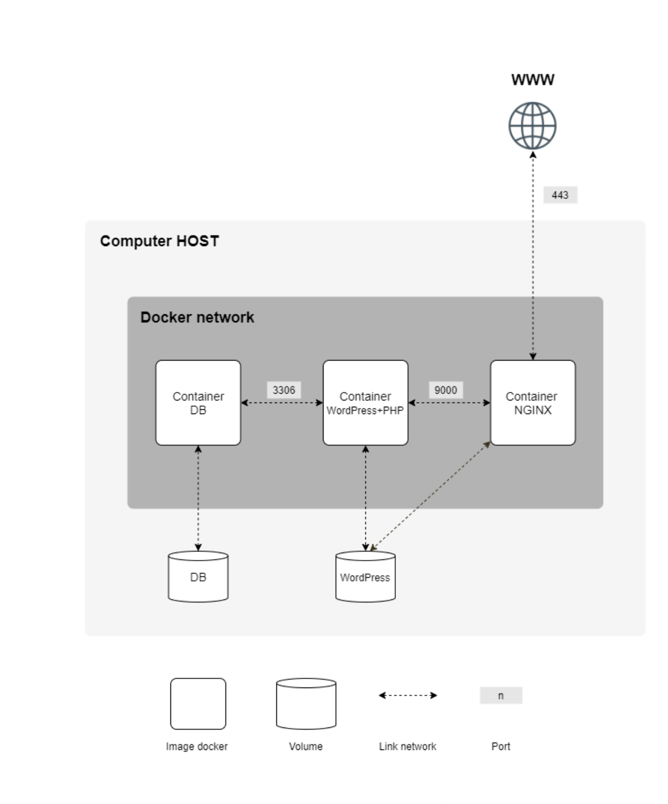

# Inception

## Description :
This project consists in setting up an infrastructure composed of different
services under specific rules, using docker compose.

Each service has to run in a dedicated container.

## Project Setup :

#### Containers :
* A Docker container that contains NGINX with TLSv1.2 or TLSv1.3 only
* A Docker container that contains WordPress + php-fpm (it must be installed and configured) only without nginx.
* A Docker container that contains MariaDB only without nginx.
Containers will restart in case of a crash.

#### Volumes :
* A volume that contains your WordPress database.
* A second volume that contains your WordPress website files.
#### Networks :
* A docker-network that establishes the connection between your containers.

## Example Diagram :

    
